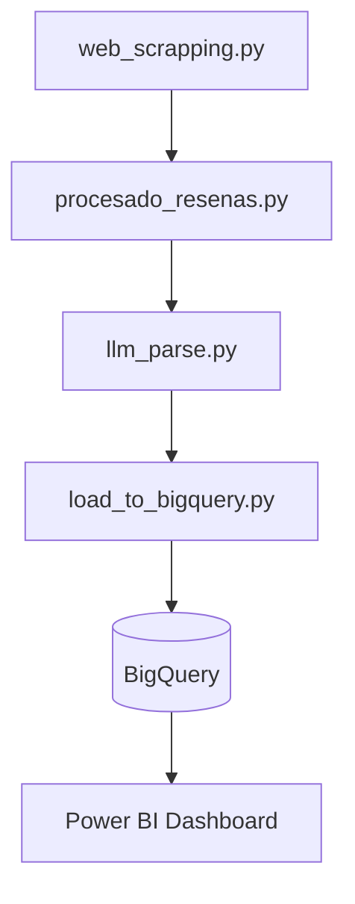

# Análisis Automatizado de Reseñas de Clientes con LLM, Power BI y BigQuery

Este proyecto implementa un **pipeline completo de análisis de reseñas de clientes**, que abarca desde la **extracción automática de datos desde Trustpilot** hasta la **clasificación semántica con modelos de lenguaje (LLM)** y la **visualización de resultados en Power BI** conectada a **Google BigQuery**.

---

## 📊 Tablero de Visualización

**Power BI Dashboard – Análisis de Percepción y Categorías de Opiniones sobre el Servicio de Entrega**
[Ver tablero en Power BI](https://app.powerbi.com/view?r=eyJrIjoiY2U4ZjkwMDEtNjhkNi00MzUyLTg0OGEtY2Q0OGFiZjI2NmQ0IiwidCI6IjVkMjFhNmQ1LWIzODMtNGUxMi1hYjFiLTY3YTUxNWZmM2RhOCIsImMiOjR9)

El tablero muestra:

* **Distribución de percepción (positiva / negativa)**
* **Categorías generales y específicas más frecuentes**
* **Exploración detallada de reseñas clasificadas**
* **Filtro por compañía o servicio**

---

## ⚙️ Descripción General del Proyecto

Este flujo automatizado transforma reseñas de clientes en **información estratégica** utilizando herramientas de analítica avanzada y aprendizaje automático:

1. **Scraping de reseñas** desde Trustpilot.
2. **Consolidación y limpieza de datos** con Pandas.
3. **Clasificación automática** mediante OpenAI GPT.
4. **Carga en BigQuery** para análisis a escala.
5. **Visualización dinámica en Power BI**.

---

## ⚠️ Nota Ética y Legal

El **scraping de Trustpilot** se utilizó **únicamente con fines educativos y de aprendizaje técnico**.
No se recomienda su uso para operaciones comerciales ni para la toma de decisiones empresariales.

Para fines profesionales, corporativos o de investigación aplicada, se debe **contactar directamente con Trustpilot** y solicitar acceso autorizado a sus **APIs oficiales o fuentes de datos aprobadas**.
Esto garantiza el cumplimiento de sus **términos de servicio, políticas de privacidad y derechos de uso de contenido**.

---

## 📂 Estructura del Proyecto

```
.
├── web_scrapping.py           # Extracción de reseñas (Trustpilot o sitios similares)
├── procesado_resenas.py       # Limpieza y combinación de CSVs
├── llm_parse.py               # Clasificación automática con OpenAI GPT
├── load_to_bigquery.py        # Carga de resultados en Google BigQuery

```

---

## 🧩 1. Extracción de Reseñas (`web_scrapping.py`)

Script configurable para recolectar reseñas desde Trustpilot u otros portales con formato estructurado (JSON-LD o HTML).

**Ejemplo de uso:**

```bash
python web_scrapping.py --url "https://es.trustpilot.com/review/empresa.com" --out review_data/trustpilot_reviews_empresa.csv
```

**Características:**

* Soporte para `requests` o `Playwright` (contenido dinámico).
* Dedupe automático y guardado compatible con Excel (`utf-8-sig`).
* Cumplimiento de `robots.txt` con modo conservador opcional.

---

## 🧮 2. Procesamiento de Reseñas (`procesado_resenas.py`)

Combina múltiples archivos CSV en un solo DataFrame, normaliza nombres de compañía y genera archivos consolidados.

**Salida:**

* `output/resenas_combinadas.xlsx`
* `output/resenas_combinadas.csv`

**Ejemplo:**

```bash
python procesado_resenas.py
```

---

## 🤖 3. Clasificación con LLM (`llm_parse.py`)

Analiza automáticamente las reseñas usando la API de OpenAI.
Cada texto se clasifica por **sentimiento** y **categoría general/específica** según un conjunto predefinido de etiquetas.

**Requiere:**

```bash
export OPENAI_API_KEY="sk-..."
```

**Ejemplo:**

```bash
python llm_parse.py
```

**Salida:**
Archivo Excel `output/resenas_clasificadas.xlsx` con resultados clasificados y trazabilidad completa.

---

## ☁️ 4. Carga en BigQuery (`load_to_bigquery.py`)

Transfiere los datos clasificados al entorno de análisis en Google BigQuery.
Ideal para conectar con herramientas BI como Power BI, Looker o Data Studio.

**Configuración:**

```python
GCP_PROJECT_ID = "tu-proyecto"
GCP_DATASET_ID = "galileo"
GCP_TABLE_ID = "resenas_clasificadas"
GOOGLE_JSON_CREDENTIALS_PATH = "credenciales.json"
```

**Ejecución:**

```bash
python load_to_bigquery.py
```

---

## 🔗 Flujo de Trabajo Completo



---

## 🧰 Requisitos Técnicos

**Versión recomendada:** Python 3.11+

**Instalación de dependencias:**


Crea el entorno con:

```bash
conda env create -f environment.yml
```

Activa el entorno:

```bash
conda activate mi_entorno
```

Finalmente, instala el navegador para Playwright (una vez dentro del entorno):

```bash
playwright install chromium
```


---

## 🔒 Buenas Prácticas

* No subir credenciales ni claves API a repositorios públicos.
* Respetar políticas de uso de datos de los sitios web.
* Validar la calidad y estructura de los datos antes de cargar a BigQuery.
* Revisar el coste por uso de la API de OpenAI y planificar el volumen de reseñas a procesar.

---

## 👤 Autores

**Francisco González**
Ingeniero Industrial | Especialista en Análisis de Datos, Calidad y Mejora Continua
[LinkedIn](https://www.linkedin.com/in/franciscogonzalez/)

**Vincent Martinez**
Regional Manager Central America & South America - Ingram Micro Miami - Cisco - Cybersecurity - Intelligence - Forensic
[LinkedIn](https://www.linkedin.com/in/vincentmart%C3%ADnez/)

Proyecto orientado a la integración de **analítica avanzada y automatización de procesos de calidad**, aplicando **Python, LLMs y Business Intelligence** para generar **insights accionables** a partir de reseñas de clientes.
