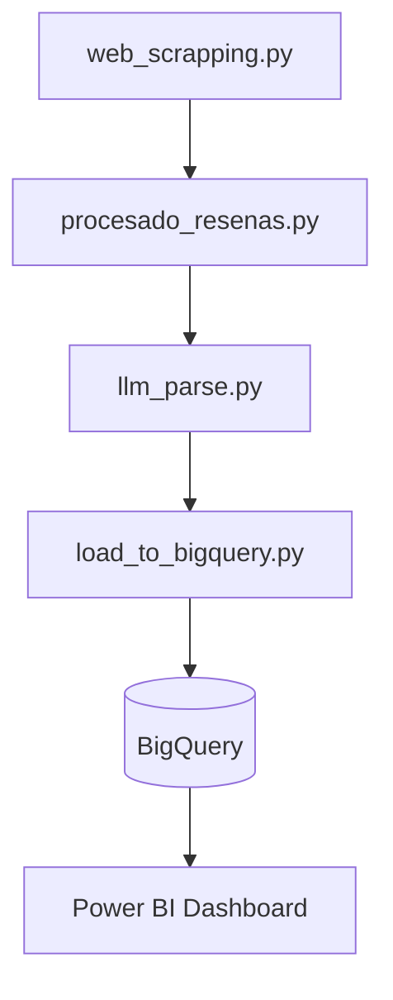

# Análisis Automatizado de Reseñas de Clientes con LLM, Power BI y BigQuery

Este proyecto implementa un **pipeline completo de análisis de reseñas de clientes**, que abarca desde la **extracción automática de datos desde Trustpilot** hasta la **clasificación semántica con modelos de lenguaje (LLM)** y la **visualización de resultados en Power BI** conectada a **Google BigQuery**.

---

## 📊 Tablero de Visualización

**Power BI Dashboard – Análisis de Percepción y Categorías de Opiniones sobre el Servicio de Entrega**
[Ver tablero en Power BI](https://app.powerbi.com/view?r=eyJrIjoiY2U4ZjkwMDEtNjhkNi00MzUyLTg0OGEtY2Q0OGFiZjI2NmQ0IiwidCI6IjVkMjFhNmQ1LWIzODMtNGUxMi1hYjFiLTY3YTUxNWZmM2RhOCIsImMiOjR9)

El tablero muestra:

* **Distribución de percepción (positiva / negativa)**
* **Categorías generales y específicas más frecuentes**
* **Exploración detallada de reseñas clasificadas**
* **Filtro por compañía o servicio**

---

## ⚙️ Descripción General del Proyecto

Este flujo automatizado transforma reseñas de clientes en **información estratégica** utilizando herramientas de analítica avanzada y aprendizaje automático:

1. **Scraping de reseñas** desde Trustpilot.
2. **Consolidación y limpieza de datos** con Pandas.
3. **Clasificación automática** mediante OpenAI GPT.
4. **Carga en BigQuery** para análisis a escala.
5. **Visualización dinámica en Power BI**.

---

## ⚠️ Nota Ética y Legal

El **scraping de Trustpilot** se utilizó **únicamente con fines educativos y de aprendizaje técnico**.
No se recomienda su uso para operaciones comerciales ni para la toma de decisiones empresariales.

Para fines profesionales, corporativos o de investigación aplicada, se debe **contactar directamente con Trustpilot** y solicitar acceso autorizado a sus **APIs oficiales o fuentes de datos aprobadas**.
Esto garantiza el cumplimiento de sus **términos de servicio, políticas de privacidad y derechos de uso de contenido**.

---

## 📂 Estructura del Proyecto

```
.
├── web_scrapping.py                    # Extracción de reseñas (Trustpilot)
├── procesado_resenas.py                # Limpieza y combinación de CSVs
├── llm_parse.py                        # Clasificación automática con OpenAI GPT
├── load_to_bigquery.py                 # Carga de resultados en Google BigQuery
├── libreria_conexion_big_query.py      # Biblioteca auxiliar para operaciones con BigQuery
├── logger_library.py                   # Sistema de logging centralizado
├── environment.yml                     # Configuración del entorno Conda
├── .env                                # Variables de entorno (no versionado)
├── alpine-realm-XXXX.json              # Credenciales de Google Cloud (no versionado)
├── Tablero.pbix                        # Dashboard de Power BI
├── diagrama.pdf                        # Diagrama del flujo del proyecto
├── output/                             # Archivos de salida procesados
│   └── resenas_combinadas.csv
└── review_data/                        # Reseñas extraídas por empresa
    ├── trustpilot_reviews_aliexpress.csv
    ├── trustpilot_reviews_dhl.csv
    └── ...
```

---

## 🧩 1. Extracción de Reseñas (`web_scrapping.py`)

Script configurable para recolectar reseñas desde Trustpilot u otros portales con formato estructurado (JSON-LD o HTML).

**Ejemplo de uso:**

```bash
python web_scrapping.py --url "https://es.trustpilot.com/review/empresa.com" --out review_data/trustpilot_reviews_empresa.csv
```

**Características:**

* Soporte para `requests` o `Playwright` (contenido dinámico).
* Dedupe automático y guardado compatible con Excel (`utf-8-sig`).
* Cumplimiento de `robots.txt` con modo conservador opcional.

---

## 🧮 2. Procesamiento de Reseñas (`procesado_resenas.py`)

Combina múltiples archivos CSV en un solo DataFrame, normaliza nombres de compañía y genera archivos consolidados.

**Salida:**

* `output/resenas_combinadas.xlsx`
* `output/resenas_combinadas.csv`

**Ejemplo:**

```bash
python procesado_resenas.py
```

---

## 🤖 3. Clasificación con LLM (`llm_parse.py`)

Analiza automáticamente las reseñas usando la API de OpenAI.
Cada texto se clasifica por **sentimiento** y **categoría general/específica** según un conjunto predefinido de etiquetas.

### Esquema de Clasificación

**Categorías Generales:**
- Entrega
- Recogida y logística inversa
- Seguimiento y comunicación
- Servicio al cliente
- Compensación y reembolso
- Calidad del producto entregado
- Repartidor
- Experiencia general
- Valor percibido
- Fidelización
- Responsabilidad y recuperación

**Categorías Específicas (ejemplos):**
- **Positivas:** Entrega puntual, Comunicación efectiva, Repartidor amable, Buena relación calidad-precio
- **Negativas:** Retraso en la entrega, Falta de respuesta a reclamaciones, Repartidor poco profesional, Costo excesivo

**Requiere:**

```bash
# Windows
setx OPENAI_API_KEY "sk-..."

# macOS/Linux
export OPENAI_API_KEY="sk-..."
```

**Ejemplo:**

```bash
python llm_parse.py
```

**Salida:**
Archivo Excel `output/resenas_clasificadas.xlsx` con resultados clasificados y trazabilidad completa.

---

## ☁️ 4. Carga en BigQuery (`load_to_bigquery.py`)

Transfiere los datos clasificados al entorno de análisis en Google BigQuery.
Ideal para conectar con herramientas BI como Power BI, Looker o Data Studio.

**Configuración:**

```python
GCP_PROJECT_ID = "tu-proyecto"
GCP_DATASET_ID = "galileo"
GCP_TABLE_ID = "resenas_clasificadas"
GOOGLE_JSON_CREDENTIALS_PATH = "credenciales.json"
```

**Ejecución:**

```bash
python load_to_bigquery.py
```

---

## 🔗 Flujo de Trabajo Completo



---

## 🧰 Requisitos Técnicos

**Versión recomendada:** Python 3.11+

### Instalación de Dependencias

**1. Crear el entorno con Conda:**

```bash
conda env create -f environment.yml
```

**2. Activar el entorno:**

```bash
conda activate investigacion_ds
```

**3. Instalar navegador para Playwright:**

```bash
playwright install chromium
```

### Configuración de Variables de Entorno

Crear un archivo `.env` en la raíz del proyecto con:

```env
# OpenAI API Key
OPENAI_API_KEY=sk-tu-clave-aqui

# Google Cloud (opcional si se usa archivo JSON directo)
GOOGLE_APPLICATION_CREDENTIALS=alpine-realm-XXXX.json
GCP_PROJECT_ID=tu-proyecto-id
```

### Credenciales de Google Cloud

1. Acceder a [Google Cloud Console](https://console.cloud.google.com/)
2. Crear un proyecto o seleccionar uno existente
3. Habilitar la API de BigQuery
4. Ir a **IAM & Admin > Service Accounts**
5. Crear una cuenta de servicio con rol **BigQuery Admin**
6. Generar y descargar la clave JSON
7. Guardar el archivo en la raíz del proyecto


---

## 📚 Módulos Auxiliares

### `libreria_conexion_big_query.py`

Biblioteca de utilidades para interactuar con Google BigQuery:

* **Funciones principales:**
  - `list_projects_datasets_and_tables()` - Listar recursos disponibles
  - `read_bigquery_to_dataframe()` - Leer tablas a pandas DataFrame
  - `write_dataframe_to_bigquery()` - Escribir DataFrame a BigQuery
  - `create_bigquery_table_from_dataframe()` - Crear tablas desde esquema
  - `make_datetime_timezone_unaware()` - Normalizar columnas datetime

### `logger_library.py`

Sistema de logging centralizado con:

* Salida por consola y archivo
* Rotación automática de logs (2 MB, 5 backups)
* Formato personalizable
* Niveles de logging configurables (DEBUG, INFO, WARNING, ERROR, CRITICAL)

**Uso:**
```python
from logger_library import setup_logger
logger = setup_logger("mi_app", log_file="logs/mi_app.log")
logger.info("Mensaje de ejemplo")
```

---

## 🔧 Troubleshooting

### Error: "OPENAI_API_KEY not found"
**Solución:** Asegúrate de haber exportado la variable de entorno o incluirla en el archivo `.env`

### Error: "No module named 'playwright'"
**Solución:** Ejecuta `playwright install chromium` dentro del entorno activado

### Error: "Access Denied" en BigQuery
**Solución:** Verifica que la cuenta de servicio tenga permisos de **BigQuery Data Editor** y **BigQuery Job User**

### Error: "Rate limit exceeded" (OpenAI)
**Solución:** Reduce el volumen de reseñas o implementa delays entre llamadas. Considera upgrade del plan de OpenAI.

### CSV con encoding incorrecto
**Solución:** El proyecto usa `utf-8-sig` por defecto. Verifica encoding con: `file --mime encoding archivo.csv`

---

## 🔒 Buenas Prácticas

* No subir credenciales ni claves API a repositorios públicos (usar `.gitignore`).
* Respetar políticas de uso de datos de los sitios web.
* Validar la calidad y estructura de los datos antes de cargar a BigQuery.
* Revisar el coste por uso de la API de OpenAI y planificar el volumen de reseñas a procesar.
* Usar el sistema de logging para auditar todas las operaciones.
* Mantener backups de las credenciales de Google Cloud en lugar seguro.

---

## 👤 Autores

**Francisco González**
Ingeniero Industrial | Especialista en Análisis de Datos, Calidad y Mejora Continua
[LinkedIn](https://www.linkedin.com/in/franciscogonzalez/)

**Vincent Martinez**
Regional Manager Central America & South America - Ingram Micro Miami - Cisco - Cybersecurity - Intelligence - Forensic
[LinkedIn](https://www.linkedin.com/in/vincentmart%C3%ADnez/)

Proyecto orientado a la integración de **analítica avanzada y automatización de procesos de calidad**, aplicando **Python, LLMs y Business Intelligence** para generar **insights accionables** a partir de reseñas de clientes.

---

## 📎 Recursos Adicionales

* **Diagrama del Flujo:** Ver `diagrama.pdf` para visualización completa del pipeline
* **Dashboard de Power BI:** Archivo `Tablero.pbix` disponible para análisis local
* **Código QR del Repositorio:** `repo_qr.png` - Acceso rápido al código fuente
* **Código QR del Dashboard:** `tablero_qr.png` - Acceso rápido a la visualización online

---

## 📝 Licencia

Ver archivo `LICENSE` para más detalles.
